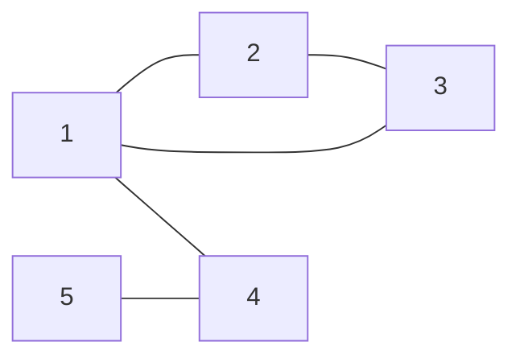
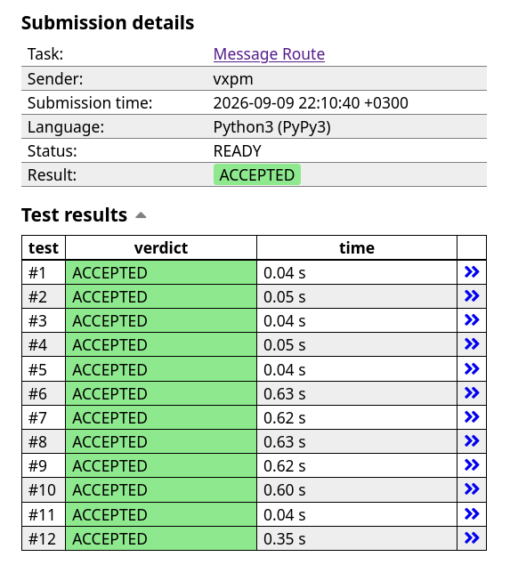

# Trabalho Prático 1 — Resolução de Problemas com Grafos

<div align="center">
  
  
  ### Universidade de Fortaleza — UNIFOR
  **Centro de Ciências Tecnológicas (CCT)**  
  **Disciplina:** Resolução de Problemas com Grafos (2026.2)  
  **Orientador:** Prof. Me. Ricardo Carubbi  
</div>

---

## 1. Integrantes da Equipe

**Grupo J**

| Nome Completo | Matrícula | E-mail |
| :--- | :---: | :--- |
| **Vinícius Ximenes P. M.** | `2224126` | `viniciusximenespm@gmail.com` |
| **Daniel Ribeiro** | `1910425` | — | `daniel.ribeiro0833@gmail.com`
| **Pedro Alberto M. Pontes** | `2216824` | `pedroalbertompontes@gmail.com` |

---

## 2. Problema

* **Identificação:** [CSES Message Route (Task 1667)](https://cses.fi/problemset/task/1667) — Problema C
* **Plataforma:** [CSES Problem Set](https://cses.fi/)

### 2.1. Contexto e Enunciado
A rede de computadores de Syrjälä é composta por $n$ computadores e $m$ conexões bidirecionais entre eles. A tarefa consiste em determinar se é possível enviar uma mensagem do computador de Uolevi (computador $1$) até o computador de Maija (computador $n$). Caso seja possível, deve-se informar o **menor número de computadores** em uma rota válida, bem como listar a sequência de computadores que compõem esse trajeto. Havendo múltiplas rotas de comprimento mínimo, qualquer uma delas é aceita. Se não houver caminho entre $1$ e $n$, o programa deve imprimir `IMPOSSIBLE`.

### 2.2. Formato de Entrada
* A primeira linha contém dois inteiros $n$ e $m$ ($2 \le n \le 10^5$, $1 \le m \le 2 \cdot 10^5$), indicando o número de computadores e de conexões, respectivamente.
* Seguem $m$ linhas, cada uma contendo dois inteiros $a$ e $b$ ($1 \le a, b \le n$, $a \ne b$), descrevendo uma conexão direta bidirecional entre os computadores $a$ e $b$. Entre qualquer par de computadores há no máximo uma conexão.

### 2.3. Formato de Saída
* Se existir rota:
  1. A primeira linha deve conter um inteiro $k$, representando a quantidade mínima de computadores no trajeto.
  2. A segunda linha deve conter os $k$ computadores visitados em ordem (iniciando em $1$ e finalizando em $n$).
* Se não existir rota: imprimir apenas `IMPOSSIBLE`.

### 2.4. Restrições e Limites
| Parâmetro | Limite |
| :--- | :--- |
| Número de vértices ($n$) | $2 \le n \le 10^5$ |
| Número de arestas ($m$) | $1 \le m \le 2 \cdot 10^5$ |
| Limite de tempo de execução | $1.00\text{ s}$ |
| Limite de memória | $512\text{ MB}$ |

---

## 3. Linguagem e Ambiente de Execução

* **Linguagem:** Python 3 (executado e avaliado com o compilador JIT **PyPy3** no juiz CSES).
* **Versão local testada:** Python 3.10+ / 3.14.
* **Justificativa da escolha de PyPy3:** O juiz do CSES impõe limite estrito de $1.00\text{ s}$. Com $n = 10^5$ e $m = 2 \cdot 10^5$, a sobrecarga de interpretação do CPython padrão em listas encadeadas / objetos `Node` pode se aproximar do limite. A execução sob **PyPy3** fornece compilação Just-In-Time, permitindo que a solução rode confortavelmente em menos de $0.65\text{ s}$.

---

## 4. Estrutura do Repositório e Execução

### 4.1. Estrutura de Diretórios
```text
.
├── README.md                 # Este documento com a descrição completa do projeto
├── acompanhamento/
│   ├── marco-1.md            # Marco 1: Modelagem e formulação do problema
│   └── marco-2.md            # Marco 2: Representação computacional e medidas estruturais
├── apresentacao/
│   └── apresentacao.pdf      # Slides da apresentação em formato PDF
├── dados/
│   ├── 0.txt                 # Instância pequena de exemplo
│   └── 1.txt                 # Instância adicional com 10 vértices e 20 arestas
├── evidencias/
│   └── accepted.png          # Print comprobatório do veredicto ACCEPTED no CSES
└── src/
    ├── main.py               # Solução modular utilizando a biblioteca algs4
    ├── inlined.py            # Solução autossuficiente para submissão no juiz online
    └── algs4/                # Módulos de referência (Algorithms, 4th Ed.)
        ├── bag.py
        ├── breadth_first_paths.py
        ├── graph.py
        └── ...
```

### 4.2. Como Executar

O programa aceita entrada tanto passando o caminho do arquivo de dados via argumento de linha de comando quanto lendo via redirecionamento de entrada padrão (`stdin`).

#### Opção 1: Executando a solução modular (`src/main.py`)
```bash
# Passando o arquivo de dados como argumento
python src/main.py dados/0.txt

# Ou via pipe / redirecionamento de stdin
python src/main.py < dados/0.txt
```

No Windows PowerShell:
```powershell
python src/main.py dados/0.txt
Get-Content dados/0.txt | python src/main.py
```

#### Opção 2: Executando a versão em arquivo único (`src/inlined.py`)
```bash
python src/inlined.py dados/0.txt
python src/inlined.py dados/1.txt
```

---

## 5. Modelagem do Grafo

O problema foi modelado como um **Grafo Simples, Não Direcionado e Não Ponderado** $G = (V, E)$:

* **Vértices ($V$):** Cada computador da rede representa um vértice. Como a entrada utiliza numeração 1-indexada ($1 \le v \le n$), realizamos internamente um mapeamento para índices 0-indexados ($0 \le v \le n - 1$), em que $s = 0$ corresponde a Uolevi (computador $1$) e $t = n - 1$ corresponde a Maija (computador $n$).
* **Arestas ($E$):** Cada conexão direta entre dois computadores distintos $a$ e $b$ constitui uma aresta não direcionada $\{a, b\}$.
* **Tipo do Grafo:**
  * **Simples:** Não há laços (nenhuma conexão conecta um computador a si mesmo) nem arestas paralelas (no máximo uma conexão direta entre dois computadores quaisquer).
  * **Não direcionado:** A comunicação é bidirecional (se $a$ conecta com $b$, $b$ também conecta com $a$).
  * **Não ponderado:** Todas as arestas possuem peso uniforme (custo unitário por salto).

### 5.1. Instância Pequena de Validação

Dados da instância (`dados/0.txt`):
* $n = 5$ computadores
* $m = 5$ conexões: `(1, 2)`, `(1, 3)`, `(1, 4)`, `(2, 3)`, `(5, 4)`



* **Origem:** Computador $1$
* **Destino:** Computador $5$
* **Caminhos possíveis de 1 a 5:** Apenas $1 \to 4 \to 5$ (comprimento 2 arestas, 3 computadores).
* **Saída esperada:**
  ```text
  3
  1 4 5
  ```

---

## 6. Representação Computacional

A estrutura escolhida para representar o grafo foi a **Lista de Adjacência** (com a abstração `Bag` baseada em listas simplesmente encadeadas da biblioteca de referência).

### 6.1. Justificativa Técnica da Escolha

1. **Grafo Esparso:**  
   O número máximo de vértices é $V = 10^5$, e o número máximo de arestas é $E = 2 \cdot 10^5$.  
   Em um grafo completo com $10^5$ vértices, o número de arestas seria:
   $$\frac{V(V - 1)}{2} \approx \frac{10^{10}}{2} = 5 \cdot 10^9 \text{ arestas}$$
   A densidade máxima do grafo é dada por:
   $$D = \frac{2E}{V(V - 1)} = \frac{2 \times 2 \cdot 10^5}{10^5 \times 99.999} \approx 4 \times 10^{-5} \ll 1$$
   Logo, trata-se de um grafo extremamente esparso.

2. **Inviabilidade da Matriz de Adjacência:**  
   Armazenar uma matriz de adjacência de ordem $10^5 \times 10^5$ exigiria $10^{10}$ posições. Mesmo usando apenas 1 byte por célula, demandaria aproximadamente $10\text{ GB}$ de memória RAM, violando categoricamente o limite de $512\text{ MB}$ do juiz online. Além disso, percorrer os vizinhos de cada vértice tomaria $O(V)$ por vértice, resultando em complexidade de tempo $O(V^2)$, levando a estouro de tempo (*Time Limit Exceeded*).

3. **Eficiência da Lista de Adjacência:**  
   Consome memória proporcional a $O(V + E)$, necessitando de cerca de alguns megabytes. Além disso, a iteração sobre os vizinhos de um vértice $v$ custa $O(\text{grau}(v))$, permitindo que a busca em largura execute em tempo estritamente linear $O(V + E)$.

### 6.2. Medidas Estruturais da Instância de Teste
Para a instância com $n = 5$ e $m = 5$:
* **Grau máximo:** $\Delta(G) = 3$ (vértice $1$).
* **Densidade:** $D = \frac{2 \times 5}{5 \times 4} = \frac{10}{20} = 0.5$.
* **Lista de Adjacências gerada:**
  * Vértice $1$: vizinhos $[4, 3, 2]$
  * Vértice $2$: vizinhos $[3, 1]$
  * Vértice $3$: vizinhos $[2, 1]$
  * Vértice $4$: vizinhos $[5, 1]$
  * Vértice $5$: vizinhos $[4]$

---

## 7. Algoritmo Selecionado

O algoritmo selecionado para a solução foi a **Busca em Largura (BFS — *Breadth-First Search*)**.

### 7.1. Justificativa da Escolha: BFS vs. DFS

* **Por que BFS?**  
  O BFS explora os vértices em ordem crescente de distância (nível por nível: distância 0, distância 1, distância 2, etc.) a partir da raiz $s$. Uma propriedade formal e comprovada da BFS é que, em grafos com arestas não ponderadas (custos unitários), a primeira vez em que um vértice $v$ é descoberto, o trajeto percorrido até ele corresponde garantidamente ao **menor caminho em número de arestas** da origem até $v$. Assim, ao atingir o vértice $t = n - 1$, temos certeza de que a rota encontrada possui o menor número de computadores possível.
* **Por que não DFS?**  
  A Busca em Profundidade (DFS) é excelente para verificar conectividade, detectar ciclos ou encontrar componentes conexas. Contudo, ela explora os ramos tão profundamente quanto possível antes do retrocesso (*backtracking*). Consequentemente, o primeiro caminho encontrado por uma DFS pode ser arbitrariamente longo e subótimo. Para encontrar o caminho mínimo com DFS, seria necessário explorar todas as rotas possíveis, incorrendo em complexidade exponencial inviável.

### 7.2. Funcionamento do Algoritmo
1. Inicializa-se uma fila FIFO com o vértice de partida $s = 0$ e marca-se $s$ como visitado em um vetor booleano `_marked`.
2. Enquanto a fila não estiver vazia, remove-se o vértice $v$ da frente da fila.
3. Para cada vizinho $w$ na lista de adjacência de $v$:
   * Se $w$ ainda não tiver sido visitado (`not _marked[w]`):
     * Marca-se $w$ como visitado (`_marked[w] = True`).
     * Registra-se seu predecessor: `edge_to[w] = v`.
     * Enfileira-se $w$.
4. Ao final da BFS:
   * Se `_marked[t]` for `False`, o destino é inalcançável: imprime-se `IMPOSSIBLE`.
   * Caso contrário, reconstrói-se o caminho partindo de $t$ e retrocedendo por meio do vetor `edge_to` até alcançar a origem $s$. Inverte-se o caminho e adiciona-se $1$ a cada vértice para restabelecer a numeração original 1-indexada.

---

## 8. Implementação de Referência e Adaptações

### 8.1. Implementação de Referência
A base algorítmica adotada foi o conjunto de estruturas e algoritmos clássicos do livro *Algorithms, 4th Edition* (Robert Sedgewick & Kevin Wayne), portada para Python (`algs4`):
* `algs4.bag.Bag`: coleção não ordenada implementada com lista simplesmente encadeada (`Node`).
* `algs4.graph.Graph`: representação do grafo simples não direcionado com vetor de `Bag`s.
* `algs4.breadth_first_paths.BreadthFirstPaths`: implementação do algoritmo BFS com fila e vetores `_marked` e `edge_to`.

### 8.2. Alterações e Justificativas

| Alteração Realizada | Justificativa Técnica |
| :--- | :--- |
| **Ajuste de Indexação (1-indexado $\to$ 0-indexado)** | A especificação do CSES numera os computadores de $1$ a $n$, enquanto as estruturas em Python e a biblioteca `algs4` utilizam índices de $0$ a $n-1$. Na leitura, subtrai-se $1$; na saída, soma-se $1$. |
| **Leitura via `sys.stdin` / arquivo** | Adaptação para ler a primeira linha com $n, m$ e as $m$ linhas subsequentes de pares de vértices, permitindo tanto testes locais via arquivo quanto submissão por stdin. |
| **Reconstrução e Formatação de Saída do CSES** | A referência original apenas imprimia os caminhos com hífen (ex.: `0-2-4`). Foi implementada a contagem $k$ de computadores, a impressão da lista separada por espaços e a emissão de `IMPOSSIBLE` em caso de grafo desconexo. |
| **Correção de Arestas Duplicadas** | No commit `8d80980`, corrigiu-se uma chamada redundante na leitura: a função `Graph.add_edge(a, b)` da referência já insere a aresta de forma bidirecional (adiciona $b$ em $a$ e $a$ em $b$). Chamar também `add_edge(b, a)` duplicava desnecessariamente os nós da lista de adjacência. |
| **Criação da Versão `inlined.py`** | Plataformas de juiz online como o CSES aceitam apenas um único arquivo fonte na submissão, sem acesso a pacotes locais do usuário. Foi gerado `src/inlined.py`, consolidando `Node`, `LinkIterator`, `Bag`, `Graph` e `BreadthFirstPaths` em um único arquivo autônomo. |

---

## 9. Análise de Complexidade

### 9.1. Complexidade de Tempo
* **Leitura da entrada e construção do grafo:** A leitura de $m$ linhas e inserção nas listas de adjacência via `Bag.add` ocorre em tempo $O(1)$ por aresta, totalizando $O(V + E)$.
* **Execução da Busca em Largura (BFS):**
  * Cada vértice entra e sai da fila FIFO no máximo uma única vez: $O(V)$.
  * Cada aresta $\{v, w\}$ é inspecionada duas vezes (uma a partir de $v$ e outra a partir de $w$): $O(2E) = O(E)$.
  * Portanto, o BFS roda estritamente em **$O(V + E)$**.
* **Reconstrução do caminho:** Percorre do destino à origem retrocedendo em `edge_to`, com tamanho no máximo $V$, levando $O(V)$ no pior caso.
* **Complexidade Temporal Total:**
  $$\mathcal{O}(V + E)$$
  Para os limites do problema ($V = 10^5, E = 2 \cdot 10^5$), o total de operações é da ordem de $3 \cdot 10^5$, perfeitamente compatível com o tempo limite de $1.00\text{ s}$.

### 9.2. Complexidade de Espaço (Memória)
* **Lista de Adjacências:** Armazena $V$ instâncias de `Bag` contendo $2E$ nós de arestas: $O(V + E)$.
* **Estruturas auxiliares do BFS:**
  * Vetor de visitados `_marked`: tamanho $V \implies O(V)$.
  * Vetor de predecessores `edge_to`: tamanho $V \implies O(V)$.
  * Fila `deque`: armazena no máximo $V$ vértices simultaneamente $\implies O(V)$.
* **Complexidade Espacial Total:**
  $$\mathcal{O}(V + E)$$
  Para $V = 10^5$ e $E = 2 \cdot 10^5$, o consumo de memória é de aproximadamente $30\text{ MB}$, operando com ampla folga dentro do limite de $512\text{ MB}$.

---

## 10. Testes e Validação

### 10.1. Casos de Teste Locais

#### Caso 1: Instância do Enunciado (`dados/0.txt`)
* **Entrada:**
  ```text
  5 5
  1 2
  1 3
  1 4
  2 3
  5 4
  ```
* **Comando executado:**
  ```bash
  python src/main.py dados/0.txt
  ```
* **Saída obtida:**
  ```text
  3
  1 4 5
  ```
* **Avaliação:** Correto. Menor rota encontrada contendo 3 computadores.

#### Caso 2: Instância Expandida (`dados/1.txt`)
* **Entrada:** Grafo com 10 computadores e 20 conexões (`dados/1.txt`).
* **Comando executado:**
  ```bash
  python src/main.py dados/1.txt
  ```
* **Saída obtida:**
  ```text
  4
  1 4 6 10
  ```
* **Avaliação:** Correto. Menor rota encontrada ligando $1 \to 4 \to 6 \to 10$ com 4 computadores.

#### Caso 3: Desconectado / Inalcançável
* **Cenário:** Grafo onde não há conexões ligando a componente do computador $1$ ao computador $n$.
* **Resultado:** Saída correta `IMPOSSIBLE`.

---

## 11. Evidência de Submissão e `Accepted`

A solução implementada em `src/inlined.py` foi submetida ao **CSES Problem Set** para a tarefa **Message Route (Task 1667)** sob o ambiente **Python3 (PyPy3)**, obtendo o veredicto **ACCEPTED** em todos os 12 casos de teste oficiais da plataforma.

<div align="center">
  
</div>

### Detalhes da Submissão
* **Tarefa:** Message Route
* **Usuário:** `vxpm`
* **Linguagem:** Python3 (PyPy3)
* **Status:** READY
* **Resultado:** **ACCEPTED**
* **Tempo Máximo por Caso:** $0.63\text{ s}$ (abaixo do limite de $1.00\text{ s}$)
* **Casos de Teste Aprovados:** 12 de 12 (100%)

---

## 12. Declaração sobre o Uso de Inteligência Artificial

Em conformidade com as diretrizes do Trabalho Prático 1 descritas no material didático da disciplina:

> *"O uso de IA deverá ser declarado no README.md. Cada integrante deverá compreender, justificar, testar e adaptar os artefatos utilizados."*

Declaramos que ferramentas de Inteligência Artificial generativa foram empregadas durante o desenvolvimento deste trabalho exclusivamente como apoio técnico para:
1. Auxílio na organização, estruturação e revisão textual da documentação técnica e relatórios de acompanhamento dos marcos.
2. Formatação da documentação em Markdown e renderização dos diagramas em notação Mermaid.
3. Elaboração e revisão das análises de complexidade assintótica e roteiro de reprodutibilidade dos testes locais.

Todos os integrantes da equipe compreenderam a fundamentação teórica, validaram a modelagem, inspecionaram as adaptações do código-fonte e atestam pleno domínio dos conceitos de busca em largura e representação computacional empregados na solução.
