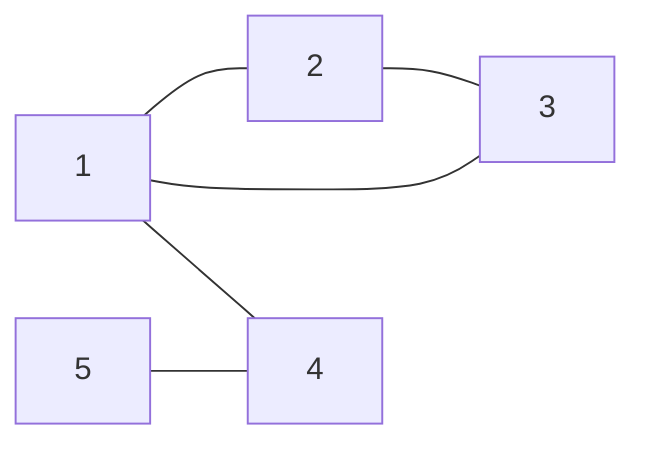

# Problema C — Message Route

A rede de Syrjälä possui $n$ computadores e $m$ conexões. A tarefa é descobrir se Uolevi consegue enviar uma mensagem para Maija e, caso seja possível, qual o número mínimo de computadores em uma rota válida.

## Entrada

A primeira linha contém dois inteiros $n$ e $m$: o número de computadores e o número de conexões. Os computadores são numerados $1, 2, \dots, n$. O computador de Uolevi é $1$ e o de Maija é $n$.

Em seguida, há $m$ linhas descrevendo as conexões. Cada linha contém dois inteiros $a$ e $b$: existe uma conexão entre esses computadores.

Toda conexão é entre dois computadores distintos, e há no máximo uma conexão entre qualquer par de computadores.

## Saída

Se for possível enviar a mensagem, imprima primeiro $k$: o número mínimo de computadores em uma rota válida. Em seguida, imprima um exemplo dessa rota. Qualquer solução válida é aceita.

Se não houver rotas, imprima `IMPOSSIBLE`.

---

# Marco 1 — Modelagem

## Enunciado

O problema consiste em descobrir se é possível enviar uma mensagem de um computador $A$ para um computador $B$ e, caso seja, descobrir o número de computadores no caminho e uma rota válida.

- Origem ($A$): computador $1$ (Uolevi)
- Destino ($B$): computador $n$ (Maija)

## Entrada

Três informações:

1. $n$ — número de computadores
2. $m$ — número de conexões
3. lista de $m$ conexões entre os computadores

## Saída

- $k$: número mínimo de computadores em uma rota válida, seguido de um exemplo de rota
- se não houver rota válida: `IMPOSSIBLE`

## Restrições

| Parâmetro | Intervalo |
| --- | --- |
| número de computadores $n$ | $2 \le n \le 10^5$ |
| número de conexões $m$ | $1 \le m \le 2 \cdot 10^5$ |
| extremidades das conexões | $1 \le a, b \le n$ |

$a$ e $b$ são computadores e sempre estão entre $1$ e $n$.

## Modelagem do grafo

| Elemento | Interpretação |
| --- | --- |
| Vértices | computadores |
| Arestas | conexões entre computadores |
| Tipo de grafo | grafo simples não direcionado: a conexão não é dirigida, não existem laços nem arestas paralelas |

## Instância pequena

```
n = 5
m = 5
arestas = [(1, 2), (1, 3), (1, 4), (2, 3), (5, 4)]
```



### Resultado esperado

```
3
1 4 5
```

Rota mínima: $1 \to 4 \to 5$ (3 computadores).

## Hipótese inicial de solução

Fazer uma busca em largura (BFS) e verificar a existência de um caminho possível, escolhendo o menor.

- **BFS** (*Breadth-First Search*): adequada para caminho mínimo em grafo não ponderado
- **DFS** (*Depth-First Search*): encontra um caminho, mas não garante o mínimo
