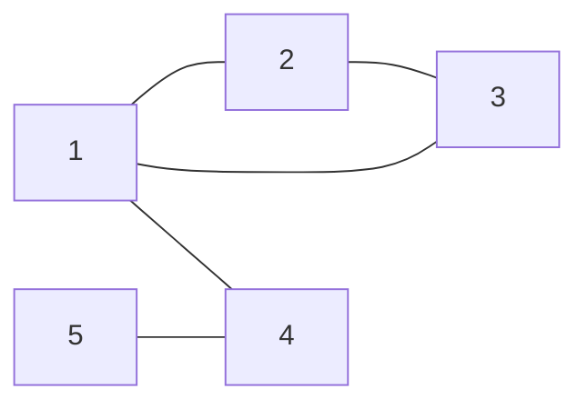

# Representação Computacional

## Representação

Lista de adjacência pois o grafo é, na maioria dos casos esparso: o número máximo de conexões é
$2 * 10^5$, que é o número máximo de conexões para aproximadamente $632$ vértices. Além de $632$
vértices a densidade do grafo desce rapidamente, ou seja, a maioria dos números de vértices terá um
grafo esparso.

## Leitura de entrada

Primeiramente, são lidos dois inteiros $n$ e $m$ representando o número de computadores e de conexões,
respectivamente. Então, um grafo vazio com $n$ vértices é inicializado.

Em seguida, são lidas $m$ linhas contendo dois inteiros $a$ e $b$, representando uma conexão entre
os computadores $a$ e $b$. Para cada linha, adiciona-se à lista de adjacência do vértice $a$ o vértice
$b$, e vice-versa.

## Medidas estruturais

```
n = 5
m = 5
arestas = [(1, 2), (1, 3), (1, 4), (2, 3), (5, 4)]
```



Grau máximo: 3 (vértice 1)
Densidade: 0.5 (5 arestas, máximo de arestas é (5 \* 4 / 2) = 10)

## Representação

Lista de adjacências:

| Vértice | Vizinhos |
| ------- | -------- |
| 1       | 2, 3, 4  |
| 2       | 1, 3     |
| 3       | 1, 2     |
| 4       | 1, 5     |
| 5       | 4        |
