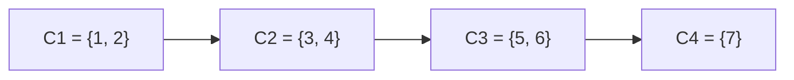

# Problema B* — Codeforces 427C Checkposts

- **Trabalho:** T2 — Conectividade e propriedades estruturais
- **Link oficial:** <https://codeforces.com/problemset/problem/427/C>
- **Marco:** 1 — Problema e conhecimento prévio

## 1. Resumo do problema

A cidade possui cruzamentos ligados por estradas de mão única. É preciso construir postos policiais em alguns cruzamentos para proteger todos eles. Um posto em `i` protege `j` quando `i = j` ou quando é possível ir de `i` até `j` e voltar de `j` até `i`.

Essa condição significa que `i` e `j` pertencem à mesma **componente fortemente conexa**. Portanto, cada componente precisa receber pelo menos um posto.

O objetivo é calcular:

1. o menor custo total para proteger todos os cruzamentos; e
2. a quantidade de maneiras de obter esse menor custo usando também o menor número possível de postos, módulo `1 000 000 007`.

## 2. Entrada

A entrada é formada por:

1. um inteiro `n`, o número de cruzamentos;
2. `n` custos `c_1, c_2, ..., c_n`, em que `c_i` é o custo de construir um posto no cruzamento `i`;
3. um inteiro `m`, o número de estradas;
4. `m` pares `u v`, indicando uma estrada de mão única de `u` para `v`.

Os cruzamentos são numerados de `1` a `n`.

## 3. Saída

Devem ser impressos dois inteiros:

- o menor custo total; e
- o número de escolhas de cruzamentos que atingem esse custo e, além disso, usam o menor número de postos, módulo `1 000 000 007`.

Como cada posto só protege a própria componente fortemente conexa, o menor número de postos é o número de componentes fortemente conexas. Em cada componente, escolhe-se exatamente um cruzamento de menor custo.

## 4. Restrições

| Parâmetro | Restrição |
| --- | --- |
| `n` | `1 ≤ n ≤ 10^5` |
| `c_i` | `0 ≤ c_i ≤ 10^9` |
| `m` | `0 ≤ m ≤ 3 · 10^5` |
| estrada | `1 ≤ u, v ≤ n` e `u ≠ v` |
| estradas repetidas | não há duas estradas com a mesma origem e destino |

O limite de tempo é de 2 segundos e o limite de memória é de 256 MB. Esses limites justificam uma solução linear no tamanho da entrada, isto é, `O(n + m)`.

## 5. Modelagem dos vértices e das arestas

Modelamos a instância como um grafo dirigido `G = (V, E)`:

| Elemento | Interpretação |
| --- | --- |
| Vértice `i` | cruzamento `i` |
| Custo `c_i` associado a `i` | custo de construir um posto em `i` |
| Aresta dirigida `(u, v)` | estrada de mão única de `u` para `v` |
| Posto em `i` protegendo `j` | `i` e `j` são mutuamente alcançáveis |

O custo está nos vértices, não nas arestas. Para cada componente fortemente conexa `C`, calculamos:

- `min(C)`: o menor custo entre os vértices de `C`;
- `qtd(C)`: quantos vértices de `C` possuem esse menor custo.

A agregação esperada é:

```text
custo mínimo = soma de min(C) para todas as componentes C
número de maneiras = produto de qtd(C) para todas as componentes C (módulo 1 000 000 007)
```

## 6. Classificação do grafo

O grafo é:

- **dirigido**, pois as estradas têm uma única direção;
- **simples como dígrafo**, pois não há laços e não há mais de uma aresta com a mesma origem e destino;
- **não ponderado nas arestas**, pois as estradas não possuem pesos;
- **ponderado nos vértices**, pois cada cruzamento tem um custo de posto;
- possivelmente **cíclico** e possivelmente não fortemente conexo;
- composto por uma ou mais componentes fortemente conexas.

Ao condensar cada componente fortemente conexa em um único vértice, obtemos um DAG. Essa observação ajuda a visualizar a estrutura, mas a propriedade central deste marco é a conectividade forte.

## 7. Resultado de aprendizagem aferido

O resultado principal é reconhecer que a condição de proteção do enunciado é uma condição de **alcance nos dois sentidos**. Em termos de grafos, isso equivale a identificar componentes fortemente conexas e usar essa decomposição para resolver uma decisão de otimização e contagem.

Também serão aferidos:

- a capacidade de traduzir estradas de mão única em arestas dirigidas;
- a distinção entre alcançabilidade em um sentido e alcançabilidade mútua;
- a compreensão de que DFS é uma busca básica que pode ser adaptada para descobrir a estrutura de conectividade forte;
- a justificativa de por que uma escolha local — menor custo em cada componente — produz o custo global mínimo.

Neste Marco 1, registramos a hipótese e a modelagem. O critério formal de reconhecimento de componentes fortemente conexas e a adaptação da implementação serão detalhados nos marcos seguintes, após o conteúdo teórico correspondente.

## 8. Participação de DFS/BFS na solução

### DFS

DFS é a busca mais diretamente relacionada à solução. Uma DFS comum informa quais vértices são alcançáveis a partir de uma origem, mas uma única execução não basta: alcançar `j` a partir de `i` não garante que seja possível voltar de `j` para `i`.

As hipóteses de adaptação são:

- **Kosaraju:** executar DFS no grafo original e no grafo com as arestas invertidas;
- **Tarjan:** executar uma DFS mantendo índices, pilha e valores de baixo alcance (`low-link`).

Ambas as estratégias identificam as componentes fortemente conexas. Depois da identificação, outra varredura dos vértices mantém o menor custo e a quantidade de ocorrências desse custo em cada componente.

### BFS

BFS também pode explorar alcançabilidade, mas não é a busca central deste problema: não há caminho mínimo nem níveis a calcular. Usar BFS a partir de cada vértice seria inadequado para os limites, pois poderia custar `O(n(n + m))`. Portanto, a hipótese inicial é usar uma solução baseada em DFS para as componentes fortemente conexas.

## 9. Instância pequena

### Entrada

```text
7
5 2 2 7 1 1 4
9
1 2
2 1
2 3
3 4
4 3
4 5
5 6
6 5
6 7
```

Uma visualização da estrutura é:



Dentro de `C1`, há as arestas `1 → 2` e `2 → 1`; dentro de `C2`, `3 → 4` e `4 → 3`; e dentro de `C3`, `5 → 6` e `6 → 5`.

### Rastreamento inicial por DFS

Partindo do vértice `1`, uma DFS pode seguir esta ordem:

```text
1 → 2 → 3 → 4 → 5 → 6 → 7
```

As arestas `2 → 1`, `4 → 3` e `6 → 5` encontram vértices já visitados. Ao final, todos os vértices foram alcançados a partir de `1`. Isso ainda não significa que todos estão na mesma componente: a DFS mostrou alcançabilidade de ida, não retorno para `1`.

Verificando a alcançabilidade nos dois sentidos, obtemos:

```text
C1 = {1, 2}
C2 = {3, 4}
C3 = {5, 6}
C4 = {7}
```

Por exemplo, `1` e `2` são mutuamente alcançáveis, mas `3` não consegue retornar para `2`; por isso `2` e `3` pertencem a componentes diferentes. O vértice `7` também forma uma componente unitária, pois não possui caminho de volta para `6`.

### Rastreamento dos custos e das escolhas

| Componente | Custos dos vértices | Menor custo | Quantidade de escolhas mínimas |
| --- | --- | ---: | ---: |
| `C1 = {1, 2}` | `5, 2` | `2` | `1` (`2`) |
| `C2 = {3, 4}` | `2, 7` | `2` | `1` (`3`) |
| `C3 = {5, 6}` | `1, 1` | `1` | `2` (`5` ou `6`) |
| `C4 = {7}` | `4` | `4` | `1` (`7`) |

Logo:

```text
custo mínimo = 2 + 2 + 1 + 4 = 9
número de maneiras = 1 · 1 · 2 · 1 = 2
```

### Saída esperada

```text
9 2
```

As duas escolhas ótimas são `{2, 3, 5, 7}` e `{2, 3, 6, 7}`. Cada uma usa quatro postos, que é o menor número possível, e tem custo total `9`.

## 10. Hipótese inicial e justificativas

1. Representar o grafo com listas de adjacência, pois `n` e `m` podem ser grandes e a entrada é uma lista de estradas.
2. Manter as arestas na direção informada; não transformar automaticamente uma estrada `u → v` em `v → u`.
3. Usar uma estratégia de SCC baseada em DFS para separar os grupos de vértices mutuamente alcançáveis.
4. Para cada grupo, escolher um único vértice de menor custo e contar quantos vértices empatam nesse menor custo.
5. Somar os menores custos e multiplicar as quantidades de empates módulo `1 000 000 007`.

Essa hipótese explica tanto a estrutura do problema quanto a instância de validação, mas ainda será confrontada com a implementação de referência e com os testes dos próximos marcos.
