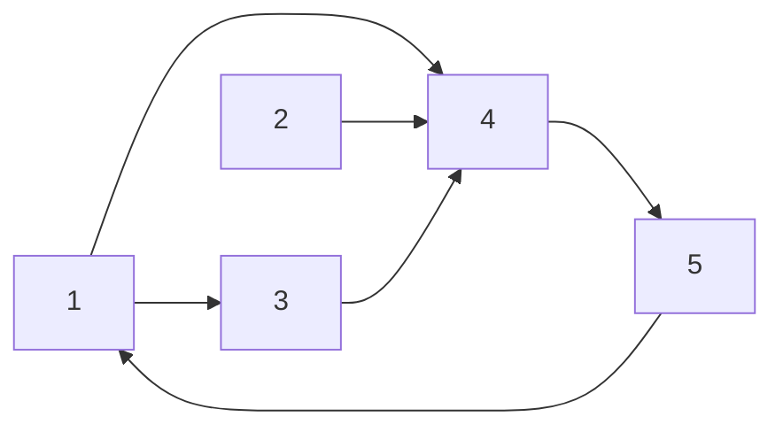

# Marco 3 — Adaptação e testes

## 1. Estado do marco

Este marco organiza a estratégia algorítmica elaborada pelo colega e incorpora o rastreamento manual da tabela final de Kosaraju. A implementação executável do T2 ainda não foi integrada em `T2/src`; portanto, os resultados desta versão são resultados manuais esperados, não uma execução automatizada.

O material manual utiliza a seguinte instância adicional do problema:

```text
5
2 8 0 6 0
6
1 4
1 3
2 4
3 4
4 5
5 1
```

A saída esperada é:

```text
8 2
```

Essa instância complementa a instância de sete vértices dos Marcos 1 e 2. A tabela final foi reorganizada a partir do material manual fornecido pelo colega e mantida também em [tabela_final_kosaraju.md](tabela_final_kosaraju.md).

## 2. Estratégia algorítmica

O problema se divide em duas etapas:

1. identificar as componentes fortemente conexas do dígrafo;
2. em cada componente, encontrar o menor custo e contar quantos vértices atingem esse mínimo.

A estratégia escolhida é o algoritmo de **Kosaraju**, baseado em duas DFS:

1. construir o grafo transposto `G^R`;
2. executar DFS em `G^R` e registrar a pós-ordem;
3. percorrer o grafo original `G` na pós-ordem reversa;
4. iniciar uma nova DFS sempre que o vértice ainda não estiver marcado;
5. atribuir o mesmo identificador de SCC a todos os vértices alcançados nessa DFS;
6. agregar custos e quantidades por identificador.

Uma BFS não é utilizada, pois o problema não solicita caminho mínimo nem níveis. A informação necessária é a ordem de término da DFS e a decomposição em componentes.

## 3. Implementação de referência

A referência consultada está no repositório `RPG` da disciplina:

- [`kosaraju_scc.py`](https://github.com/carubbi/RPG/blob/main/algs4-py/algs4/kosaraju_scc.py);
- [`KosarajuSharirSCC.java`](https://github.com/carubbi/RPG/blob/main/algs4-java/algs4/KosarajuSharirSCC.java);
- `Digraph`, para representar arestas dirigidas;
- `DepthFirstOrder`, para registrar a pós-ordem da DFS no grafo transposto.

O diretório `T2/src` ainda não foi criado. As alterações abaixo descrevem a adaptação que deverá ser integrada no próximo passo de implementação.

## 4. Alterações e justificativas

| Elemento | Adaptação para o Checkposts | Justificativa |
| --- | --- | --- |
| Representação | usar `Digraph` e listas de adjacência | as estradas possuem direção e `n`, `m` podem ser grandes |
| Leitura | ler `n`, os `n` custos, `m` e as `m` arestas | o formato do Codeforces inclui custos de vértices antes das estradas |
| Direção | adicionar somente `u → v` | não se deve transformar uma estrada de mão única em duas arestas |
| Transposto | usar `G.reverse()` ou construir `G^R` | Kosaraju precisa da inversão das arestas apenas como etapa auxiliar |
| Identificação | usar `scc.id[v]` após a segunda DFS | vértices com o mesmo identificador pertencem à mesma SCC |
| Agregação | manter menor custo e quantidade de empates por SCC | cada SCC recebe exatamente um posto na solução com menor número de postos |
| Saída | imprimir `custo_total quantidade_de_maneiras` | corresponde ao formato exigido pelo problema |

Se a versão Python em arquivo único for escolhida, será necessário incorporar no mesmo arquivo apenas as classes usadas por essa estratégia, como `Bag`, `Digraph`, `DepthFirstOrder` e `KosarajuSCC`. `Graph` e `BreadthFirstPaths`, usados no T1, não participam desta solução.

Antes da execução, também deve ser conferido o iterador da referência: a classe `LinkIterator` possui `__next__`, mas a implementação disponibilizada não define `__iter__`. Caso a versão seja reutilizada, ela deverá retornar a si própria em `__iter__` para funcionar corretamente em laços `for`.

Como as DFSs da referência são recursivas, a implementação final deverá considerar o limite de recursão do Python ou usar uma estratégia iterativa. Essa decisão será registrada junto ao código, sem alterar a complexidade assintótica do algoritmo.

## 5. Instância de validação

### 5.1. Custos

| Vértice | `1` | `2` | `3` | `4` | `5` |
| --- | ---: | ---: | ---: | ---: | ---: |
| Custo | `2` | `8` | `0` | `6` | `0` |

### 5.2. Grafo original

As arestas dirigidas são:

```text
1 → 4
1 → 3
2 → 4
3 → 4
4 → 5
5 → 1
```



As listas de adjacência, considerando que `Bag.add()` insere no início, ficam:

| Vértice | Adjacência em `G` |
| --- | --- |
| `1` | `[3, 4]` |
| `2` | `[4]` |
| `3` | `[4]` |
| `4` | `[5]` |
| `5` | `[1]` |

## 6. Primeira fase de Kosaraju: grafo transposto

Invertendo as arestas, obtemos:

```text
4 → 1
3 → 1
4 → 2
4 → 3
5 → 4
1 → 5
```

As listas de adjacência do grafo transposto são:

| Vértice | Adjacência em `G^R` |
| --- | --- |
| `1` | `[5]` |
| `2` | `[]` |
| `3` | `[1]` |
| `4` | `[3, 2, 1]` |
| `5` | `[4]` |

A DFS em `G^R` começa pelo vértice `1` e segue:

```text
1 → 5 → 4 → 3 → 1
              ↘ 2
```

Os vértices `1`, `5`, `4` e `3` formam um ciclo de retorno. A partir de `4`, o vértice `2` também é visitado, mas `2` não possui arestas de saída no transposto.

O rastreamento da pós-visita é:

| Evento | Pilha de chamadas | Pós-ordem após o evento |
| --- | --- | --- |
| entra em `1` | `[1]` | `[]` |
| entra em `5` | `[1, 5]` | `[]` |
| entra em `4` | `[1, 5, 4]` | `[]` |
| entra em `3` | `[1, 5, 4, 3]` | `[]` |
| `3 → 1`, já visitado | `[1, 5, 4, 3]` | `[]` |
| termina `3` | `[1, 5, 4]` | `[3]` |
| entra em `2` | `[1, 5, 4, 2]` | `[3]` |
| termina `2` | `[1, 5, 4]` | `[3, 2]` |
| termina `4` | `[1, 5]` | `[3, 2, 4]` |
| termina `5` | `[1]` | `[3, 2, 4, 5]` |
| termina `1` | `[]` | `[3, 2, 4, 5, 1]` |

Logo:

```text
pós-ordem         = [3, 2, 4, 5, 1]
pós-ordem reversa = [1, 5, 4, 2, 3]
```

## 7. Segunda fase: tabela final de Kosaraju

A segunda DFS percorre o grafo original na ordem:

```text
RPostorder = [1, 5, 4, 2, 3]
```

Nesta tabela, `EdgeTo` representa o predecessor usado na árvore da DFS. Ele é registrado para tornar o rastreamento explícito, embora o identificador de SCC seja o estado essencial para a solução.

| `RPostorder[i]` | Vértice | `Marked` | `EdgeTo` | SCC |
| --- | ---: | :---: | ---: | ---: |
| `RPostorder[0]` | `1` | X | — | `0` |
| `RPostorder[1]` | `5` | X | `4` | `0` |
| `RPostorder[2]` | `4` | X | `3` | `0` |
| `RPostorder[3]` | `2` | X | — | `1` |
| `RPostorder[4]` | `3` | X | `1` | `0` |

### 7.1. Tabela organizada por vértice

| Vértice | `Marked` | `EdgeTo` | SCC |
| ---: | :---: | ---: | ---: |
| `1` | X | — | `0` |
| `2` | X | — | `1` |
| `3` | X | `1` | `0` |
| `4` | X | `3` | `0` |
| `5` | X | `4` | `0` |

Portanto:

```text
SCC 0 = {1, 3, 4, 5}
SCC 1 = {2}
```

O vértice `2` alcança a SCC `0` por `2 → 4`, mas nenhum vértice de `SCC 0` alcança `2`. Por isso, essa aresta não faz as duas componentes se unirem.

## 8. Cálculo dos custos e das maneiras

### SCC 0 = `{1, 3, 4, 5}`

| Vértice | `1` | `3` | `4` | `5` |
| --- | ---: | ---: | ---: | ---: |
| Custo | `2` | `0` | `6` | `0` |

O menor custo é `0`, encontrado nos vértices `3` e `5`:

```text
minimo(SCC 0) = 0
qtd(SCC 0) = 2
```

### SCC 1 = `{2}`

```text
minimo(SCC 1) = 8
qtd(SCC 1) = 1
```

Assim:

```text
custo total = 0 + 8 = 8
quantidade de maneiras = 2 × 1 = 2
saída esperada = 8 2
```

As duas escolhas ótimas são `{2, 3}` e `{2, 5}`.

## 9. Testes e validação

Como ainda não há código integrado em `T2/src`, os resultados abaixo são validações manuais e saídas esperadas.

### 9.1. Caso positivo com empate

É a instância principal deste marco:

```text
entrada: 5 vértices, 6 arestas
saída esperada: 8 2
```

O `2` da saída vem do empate entre os vértices `3` e `5`, ambos com custo `0` na `SCC 0`.

### 9.2. Caso de controle da direção

Se as arestas fossem tratadas incorretamente como não direcionadas, todos os vértices ficariam conectados na mesma componente e o resultado seria diferente. Esse caso valida que a adaptação deve inserir somente a aresta `u → v` informada.

### 9.3. Caso-limite sem arestas

```text
3
0 0 5
0
```

Cada vértice forma uma SCC unitária. O custo esperado é `0 + 0 + 5 = 5`, e há uma única escolha em cada componente:

```text
saída esperada: 5 1
```

Os testes automatizados e a submissão ao Codeforces ainda serão realizados depois da integração do código.

## 10. Complexidade

Se `V` é o número de vértices e `E` o número de arestas:

- construção de `G` e `G^R`: `O(V + E)`;
- primeira DFS: `O(V + E)`;
- segunda DFS: `O(V + E)`;
- agregação dos custos: `O(V)`.

Logo, o tempo total é:

```text
O(V + E)
```

As listas de adjacência, o grafo transposto e os vetores auxiliares ocupam:

```text
O(V + E)
```

## 11. Próxima etapa

O próximo passo é criar a implementação em Python ou Java dentro de `T2/src`, adaptar a leitura do Codeforces, executar os casos desta seção e registrar as alterações efetivamente realizadas em relação à referência `algs4`.
