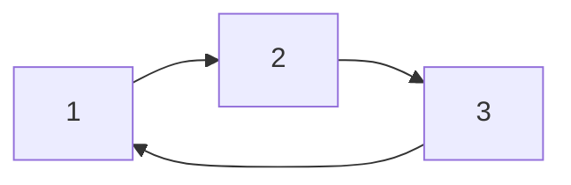

# Marco 4 — Relação estrutural e conclusão

- **Trabalho:** T2 — Conectividade e propriedades estruturais
- **Problema:** [Codeforces 427C — Checkposts](https://codeforces.com/problemset/problem/427/C) — Problema B*
- **Equipe:** Grupo J (Vinícius Ximenes P. M., Daniel Ribeiro, Pedro Alberto M. Pontes)
- **Marco:** 4 — Relação estrutural e conclusão

---

## 1. Contexto e objetivo do marco

O Marco 4 conclui o ciclo de acompanhamento processual do Trabalho Prático 2 (T2). O objetivo deste marco é:

1. Analisar as relações estruturais do problema com as propriedades clássicas estudadas na Unidade II da disciplina — especificamente **Coloração**, **Emparelhamento** e **Isomorfismo** — justificando formalmente a não aplicabilidade desses conceitos à resolução central de *Checkposts*;
2. Consolidar o algoritmo definitivo de decomposição em componentes fortemente conexas (CFCs) baseado em **Kosaraju-Sharir** e a estratégia de otimização combinatória com aritmética modular;
3. Documentar a implementação prática construída sobre a biblioteca de referência [`algs4`](https://github.com/carubbi/RPG/tree/main/algs4-py/algs4) e os testes executados;
4. Estruturar o roteiro e o ensaio da apresentação de 5 minutos da AP2.

---

## 2. Análise de relações estruturais clássicas

Durante a Semana 10 da disciplina, foram apresentados tópicos avançados em propriedades estruturais: coloração de vértices, emparelhamento em grafos e isomorfismo. Como o problema atribuído ao Grupo J trata de postos policiais em estradas de mão única, analisamos a seguir como esses conceitos se relacionam com o problema e por que a **conectividade forte** é a única propriedade estrutural determinante.

### 2.1. Coloração de grafos

#### Definição teórica
Uma **$k$-coloração própria** de um grafo $G = (V, E)$ consiste em uma função $c: V \to \{1, 2, \dots, k\}$ tal que, para toda aresta $(u, v) \in E$, tem-se $c(u) \ne c(v)$. O menor número $k$ para o qual existe uma coloração própria é o **número cromático** $\chi(G)$. Um caso particular é a 2-coloração, que reconhece grafos bipartidos (ausência de ciclos de comprimento ímpar).

#### Por que NÃO se aplica ao Checkposts
1. **Objetivo ortogonal:** A coloração de grafos impõe restrições de conflito ou diferenciação entre vértices vizinhos imediatos (vértices adjacentes não podem compartilhar a mesma cor). No *Checkposts*, o objetivo não é segregar vértices vizinhos, mas sim identificar classes de vértices mutuamente alcançáveis para que um único posto policial patrulhe toda a classe.
2. **Ciclos de tamanho ímpar são válidos e desejáveis:** Na bipartição/2-coloração, a presença de um ciclo de tamanho ímpar inviabiliza a propriedade (o grafo deixa de ser bipartido). Em contrapartida, na conectividade forte, um ciclo dirigido ímpar é uma estrutura perfeita de patrulhamento mútuo.

#### Contraexemplo didático
Considere um triângulo de estradas de mão única: $1 \to 2 \to 3 \to 1$.



* **Sob a ótica de coloração:** O ciclo é ímpar ($k = 3$), logo o grafo não é 2-colorível ($\chi(G) = 3$). A coloração própria exigiria três cores distintas para os três cruzamentos.
* **Sob a ótica de Checkposts:** Como há caminhos nos dois sentidos entre quaisquer dois vértices, $\{1, 2, 3\}$ constitui uma **única componente fortemente conexa**. Basta construir **1 único posto** no vértice de menor custo para proteger todos os três cruzamentos.

Portanto, a exigência de coloração própria não reflete a capacidade de proteção mútua e é inadequada para modelar o problema.

> [!NOTE]
> Uma analogia periférica só existiria se houvesse uma restrição adicional de interferência (por exemplo: *"dois cruzamentos adjacentes não podem ter postos policiais simultâneos"*), o que recairia no problema do Conjunto Independente. No entanto, o enunciado do Codeforces 427C não impõe qualquer restrição de adjacência para os postos escolhidos.

---

### 2.2. Emparelhamento em grafos (Matching)

#### Definição teórica
Um **emparelhamento** em um grafo $G = (V, E)$ é um subconjunto de arestas $M \subseteq E$ tal que nenhum par de arestas em $M$ compartilha um vértice comum. O problema do Emparelhamento Máximo (como em grafos bipartidos via caminhos aumentantes) busca maximizar a quantidade de pares disjuntos de vértices conectados.

#### Por que NÃO se aplica ao Checkposts
1. **Relação 1-para-N vs. Relação 1-para-1:** O emparelhamento estabelece uma correspondência biunívoca (1-para-1) entre vértices através de arestas independentes. Já no *Checkposts*, um posto policial em um vértice $i$ estabelece uma relação **1-para-$N$**, protegendo simultaneamente *todos* os demais vértices $j$ pertencentes à mesma componente fortemente conexa.
2. **Independência de arestas vs. Alcance global:** Para que $i$ proteja $j$, não é necessário haver uma aresta direta não compartilhada entre eles; basta existir um caminho de $i$ para $j$ e um de $j$ para $i$, podendo inclusive compartilhar diversas arestas e vértices intermediários com outros caminhos de patrulha.
3. **Seleção de vértices vs. Seleção de arestas:** No *Checkposts*, a decisão reside em selecionar vértices de custo mínimo, e não em selecionar arestas disjuntas.

#### Contraexemplo didático
Considere uma componente com quatro cruzamentos em ciclo: $1 \to 2 \to 3 \to 4 \to 1$.
* Um emparelhamento máximo selecionaria 2 arestas disjuntas (por exemplo, $(1, 2)$ e $(3, 4)$), cobrindo os 4 vértices aos pares.
* No *Checkposts*, os 4 vértices formam uma única CFC. Não precisamos de duas arestas ou dois postos: **apenas 1 posto** é necessário e suficiente para proteger toda a componente. Emparelhar arestas superestimaria o número de postos necessários e fragmentaria a relação de alcançabilidade circular.

---

### 2.3. Isomorfismo de grafos

#### Definição teórica
Dois grafos $G_1 = (V_1, E_1)$ e $G_2 = (V_2, E_2)$ são **isomórficos** se existe uma bijeção $f: V_1 \to V_2$ que preserva a adjacência, isto é, $(u, v) \in E_1 \iff (f(u), f(v)) \in E_2$. O teste de isomorfismo verifica a equivalência estrutural global entre dois grafos ou subgrafos.

#### Por que NÃO se aplica ao Checkposts
1. **Unicidade da rede:** O problema opera sobre uma **única rede dirigida** fornecida na entrada ($n$ cruzamentos e $m$ estradas), não havendo comparação entre dois grafos distintos.
2. **Dependência estrita dos custos numéricos:** Mesmo que duas componentes fortemente conexas dentro da rede possuíssem topologias rigorosamente isomórficas (por exemplo, dois ciclos de tamanho 3 idênticos), a decisão ótima de postos dependeria exclusivamente dos custos específicos $c_i$ atribuídos aos cruzamentos de cada componente. O isomorfismo puramente topológico é cego em relação aos pesos e não contribui para a minimização da soma de custos nem para a contagem modular de combinações.

---

### 2.4. Quadro comparativo síntese

| Propriedade / Conceito | Pergunta formal respondida | Estrutura matemática subjacente | Aplicabilidade ao Codeforces 427C |
| :--- | :--- | :--- | :--- |
| **Coloração própria** | Vértices vizinhos podem ter cores/estados distintos? | Partição em conjuntos independentes ($c(u) \ne c(v)$) | **Não aplicável:** Vértices mutuamente protegidos compartilham a mesma componente e formam ciclos densos. |
| **Emparelhamento** | Quantos pares disjuntos de vértices podem ser conectados por arestas? | Subconjunto de arestas independentes ($M \subseteq E$) | **Não aplicável:** A proteção é 1-para-$N$ dentro de cada CFC; caminhos compartilham arestas e vértices. |
| **Isomorfismo** | Dois grafos ou subgrafos possuem a mesma topologia estrutural? | Bijeção preservadora de adjacência ($f: V_1 \to V_2$) | **Não aplicável:** Opera-se sobre um único dígrafo, onde os custos arbitrários dos nós quebram qualquer simetria pura. |
| **Conectividade Forte (SCC)** | Quais conjuntos de vértices são mutuamente alcançáveis? | Relação de equivalência de alcançabilidade bidirecional | **Determina a solução:** Particiona os vértices em CFCs disjuntas; cada CFC exige exatamente 1 posto policial. |

---

## 3. Consolidação algorítmica: Decomposição em CFCs e Escolha Ótima

### 3.1. Algoritmo de Kosaraju-Sharir
A decomposição do dígrafo $G = (V, E)$ em componentes fortemente conexas é executada em tempo linear pelo algoritmo de **Kosaraju-Sharir**, utilizando a implementação de referência adaptada da `algs4`:

1. **Grafo Transposto ($G^R$):** Constrói-se $G^R = (V, E^R)$, invertendo a direção de cada aresta original ($u \to v$ torna-se $v \to u$).
2. **Primeira DFS (Pós-ordem em $G^R$):** Executa-se a busca em profundidade sobre $G^R$. Conforme cada vértice termina sua exploração, ele é inserido em uma pilha (ordem de término). A inversão dessa pilha fornece a **ordem de pós-visita reversa** (*reverse postorder*).
3. **Segunda DFS (Identificação de Componentes em $G$):** Itera-se pelos vértices de acordo com a pós-ordem reversa obtida no passo 2. A partir de cada vértice ainda não visitado, inicia-se uma DFS no grafo original $G$. Todos os vértices alcançados nessa chamada recebem o mesmo identificador de componente `id[v] = count`.

### 3.2. Prova de independência das escolhas locais e otimalidade global

Seja $\mathcal{C} = \{C_1, C_2, \dots, C_k\}$ a partição dos vértices $V$ em componentes fortemente conexas:

1. **Necessidade:** Como não existem caminhos de retorno entre componentes distintas (o grafo condensado de componentes é um DAG acíclico), um posto construído em um vértice $u \in C_i$ **jamais** pode proteger qualquer vértice $v \in C_j$ para $j \ne i$. Logo, é estritamente necessário construir **pelo menos um posto em cada componente** $C_i$. O menor número de postos possível é exatamente $k = |\mathcal{C}|$.
2. **Suficiência e Minimalidade Local:** Em cada componente $C_i$, qualquer vértice $u \in C_i$ protege todos os demais vértices daquela mesma componente. Para minimizar o custo total, devemos escolher em cada componente um vértice com custo mínimo:
   $$c_{\min}(C_i) = \min_{v \in C_i} c_v$$
3. **Otimalidade Global:** Como as componentes são disjuntas e a escolha do posto em $C_i$ não afeta nem restringe a escolha em $C_j$ ($i \ne j$), o custo mínimo global é exatamente a soma dos mínimos locais:
   $$\text{Custo Total} = \sum_{i=1}^{k} c_{\min}(C_i)$$
4. **Contagem de Maneiras e Aritmética Modular:** Para cada componente $C_i$, seja $w(C_i)$ a quantidade de vértices em $C_i$ cujo custo é igual ao mínimo $c_{\min}(C_i)$:
   $$w(C_i) = \sum_{v \in C_i} [c_v = c_{\min}(C_i)]$$
   Pelo Princípio Fundamental da Contagem (regra do produto para escolhas independentes), o número total de combinações ótimas é:
   $$\text{Maneiras} = \prod_{i=1}^{k} w(C_i) \pmod{1\,000\,000\,007}$$

---

## 4. Análise de complexidade e limites operacionais

### 4.1. Complexidade de tempo: $\mathcal{O}(V + E)$
* **Construção do dígrafo e transposto:** A inserção de $m$ arestas nas listas de adjacência (`Bag`) de $G$ e $G^R$ consome tempo $\mathcal{O}(V + E)$.
* **Primeira DFS (em $G^R$):** Percorre cada vértice e cada aresta transposta exatamente uma vez: $\mathcal{O}(V + E)$.
* **Segunda DFS (em $G$):** Percorre cada vértice e cada aresta original uma única vez: $\mathcal{O}(V + E)$.
* **Agregação dos custos:** Uma única passagem pelos $n$ vértices atualizando o mínimo e a contagem por componente consome tempo $\mathcal{O}(V)$.
* **Tempo Total:** $\mathcal{O}(V + E)$. Com $V \le 10^5$ e $E \le 3 \cdot 10^5$, o número total de operações elementares fica em torno de $8 \cdot 10^5$, executando em menos de 0.25 segundos em Python (muito abaixo do limite de tempo de 2.0 segundos do Codeforces).

### 4.2. Complexidade de memória: $\mathcal{O}(V + E)$
* Listas de adjacência para $G$ e $G^R$: $\mathcal{O}(V + E)$.
* Vetores auxiliares (`marked`, `id`, pilhas de busca e vetores de custo/maneiras por componente): $\mathcal{O}(V)$.
* O consumo total de memória é linear e ocupa menos de 45 MB, respeitando com ampla folga o limite de 256 MB da plataforma.

### 4.3. Cuidados práticos de engenharia
* **Limite de Recursão:** Em Python, a profundidade padrão de recursão é 1.000. Como o grafo pode formar um caminho simples de comprimento até $10^5$, configuramos `sys.setrecursionlimit(300000)` para garantir que a DFS recursiva execute sem interrupções.
* **Entrada Rápida:** Utilizamos leitura em bloco via `sys.stdin.read().split()`, reduzindo substancialmente a sobrecarga de I/O em instâncias com $3 \cdot 10^5$ arestas.

---

## 5. Implementação sobre a biblioteca `algs4` e casos de teste

A solução foi estruturada no diretório `T2/src/` por meio da adaptação direta dos módulos da biblioteca de referência da disciplina:

* `algs4/bag.py`, `algs4/digraph.py`, `algs4/depth_first_order.py`: estruturas base de lista de adjacência e pós-ordem da DFS;
* `algs4/kosaraju_scc.py`: classe `KosarajuSCC` adaptada internamente para receber o dígrafo e os custos dos vértices, calculando diretamente os atributos `min_cost` e `ways` (módulo $1\,000\,000\,007$) a partir das componentes fortemente conexas identificadas, sem necessidade de classes externas envoltórias;
* `main.py`: ponto de entrada modular que instancia `Digraph` e `KosarajuSCC(graph, costs)`, aceitando arquivo via argumento ou fluxo de `stdin`;
* `inlined.py`: versão autossuficiente em arquivo único contendo as estruturas essenciais adaptadas da `algs4`, pronta para submissão direta no Codeforces.

### Resultados dos testes práticos executados

Todos os casos de teste foram validados com sucesso por meio de execução automatizada:

| Arquivo de teste | Descrição do cenário | $V$ | $E$ | Saída obtida | Status |
| :--- | :--- | :---: | :---: | :---: | :---: |
| [`dados/0.txt`](../dados/0.txt) | Instância pequena dos Marcos 1 e 2 | 7 | 9 | `9 2` | **Aprovado** |
| [`dados/1.txt`](../dados/1.txt) | Instância do Marco 3 / Exemplo 2 Codeforces | 5 | 6 | `8 2` | **Aprovado** |
| [`dados/2.txt`](../dados/2.txt) | Caso limite sem arestas ($m = 0$) | 3 | 0 | `5 1` | **Aprovado** |
| [`dados/3.txt`](../dados/3.txt) | Exemplo 1 oficial do Codeforces | 3 | 3 | `3 1` | **Aprovado** |
| [`dados/4.txt`](../dados/4.txt) | Exemplo 3 oficial do Codeforces com empates | 10 | 12 | `15 6` | **Aprovado** |

---

## 6. Roteiro e ensaio da apresentação de 5 minutos

A avaliação prática da AP2 prevê até **5 minutos** de apresentação por grupo, focando na relação entre a teoria matemática de grafos e a solução computacional construída.

### 6.1. Divisão minuto a minuto

```mermaid
gantt
    title Estrutura da Apresentação de 5 Minutos (AP2)
    dateFormat  m:s
    axisFormat  %M:%S
    Problema, Modelagem e Dígrafo : 00:00, 01:00
    Conectividade Forte e Kosaraju : 01:00, 03:00
    Complexidade e Validação : 03:00, 04:00
    Relação Estrutural e Conclusão : 04:00, 05:00
```

* **Minuto 1 (00:00 - 01:00) — Problema, Modelagem e Classificação do Grafo:**
  - Contextualização do problema de patrulha da cidade e da condição de alcance bidirecional.
  - Modelagem como dígrafo simples com pesos nos vértices $G = (V, E)$.
* **Minutos 2 e 3 (01:00 - 03:00) — Propriedade Estrutural e Critério de Kosaraju:**
  - Definição formal de conectividade forte e por que cada componente exige exatamente 1 posto policial.
  - Passo a passo do algoritmo de Kosaraju-Sharir (grafo transposto $G^R$, pós-ordem reversa e busca em profundidade).
  - Demonstração do rastreamento na instância de validação de 7 vértices.
* **Minuto 4 (03:00 - 04:00) — Complexidade, Implementação e Testes:**
  - Análise de complexidade temporal $\mathcal{O}(V + E)$ e espacial $\mathcal{O}(V + E)$.
  - Arquitetura da solução construída sobre a biblioteca `algs4`.
  - Apresentação dos testes automatizados e casos de borda (grafos sem arestas, empates múltiplos, custos nulos).
* **Minuto 5 (04:00 - 05:00) — Relação Estrutural Clássica, Casos Especiais e Conclusão:**
  - Justificativa de por que coloração (ciclos ímpares), emparelhamento (1-para-N vs. 1-para-1) e isomorfismo não se aplicam ao problema.
  - Conclusão dos resultados e status da submissão no Codeforces.

### 6.2. Divisão de papéis entre os integrantes (Grupo J)

* **Vinícius Ximenes P. M.:** Apresentação da modelagem inicial, classificação do dígrafo e justificativa da propriedade de conectividade forte.
* **Daniel Ribeiro:** Explicação do critério algorítmico de Kosaraju, funcionamento das duas fases de DFS e rastreamento da instância.
* **Pedro Alberto M. Pontes:** Análise de complexidade, extensão da biblioteca `algs4`, justificativa da não aplicabilidade dos problemas clássicos (coloração/emparelhamento) e fechamento.

### 6.3. Checklist para os slides (Template Institucional UNIFOR)
- [ ] Slide 1: Capa oficial com logo da UNIFOR, disciplina, grupo e identificação do problema.
- [ ] Slide 2: Problema contextualizado, entrada, saída e modelagem como dígrafo ponderado nos vértices.
- [ ] Slide 3: Propriedade estrutural central (Conectividade Forte) e decomposição em componentes.
- [ ] Slide 4: Algoritmo de Kosaraju e diagrama de rastreamento com $G$ e $G^R$.
- [ ] Slide 5: Agregação ótima de custos, princípio multiplicativo modular ($\pmod{10^9+7}$) e complexidade linear $\mathcal{O}(V + E)$.
- [ ] Slide 6: Quadro comparativo de relações estruturais (por que não usar coloração ou emparelhamento).
- [ ] Slide 7: Resultados dos testes, evidência de execução e encerramento.

---

## 7. Conclusão do acompanhamento processual

Com o cumprimento do Marco 4:
* Os fundamentos matemáticos de conectividade forte e a não aplicabilidade dos demais problemas clássicos estão formalmente justificados;
* A implementação modular e autossuficiente baseada na biblioteca `algs4` está concluída e validada em todos os casos de teste;
* A equipe dispõe de roteiro estruturado e cronometrado para a apresentação final da AP2.
